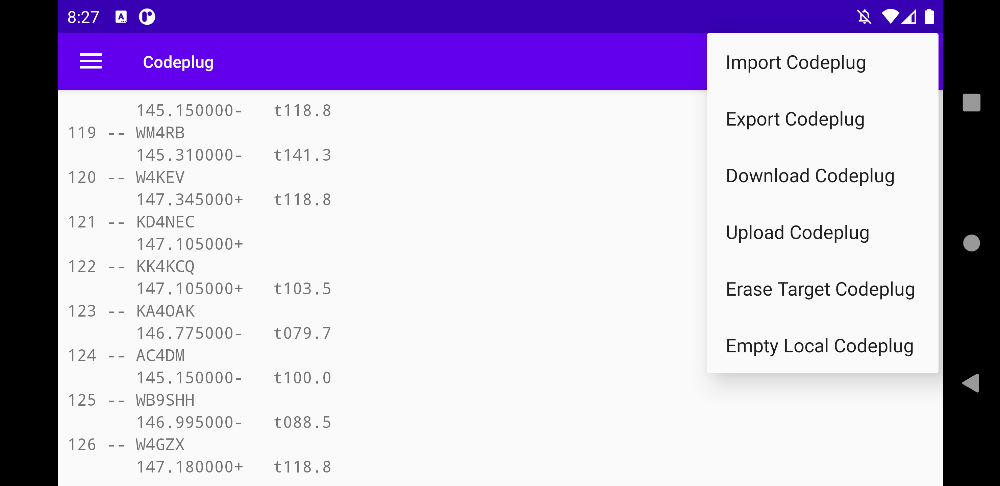

# Goodspeed's CAT Tool

This is the source code for an Android app for programming the Kenwood
TH-D74, TH-D72, and TM-D710.  Based on
[CodePlugTool](https://github.com/travisgoodspeed/codeplugtool), a
pure-Java library and command line tool for controlling these same
radios.

If you'd rather just install the app, it's available for free as
[Goodspeed's CAT
Tool](https://play.google.com/store/apps/details?id=com.kk4vcz.goodspeedscattool)
in the Play Store.



## Status

The app is now functional for editing radio memories, including
uploading to and downloading from a radio over Bluetooth and TCP, as
well as importing and exporting a CSV format compatible with
[CHIRP](https://chirp.danplanet.com/projects/chirp/wiki/Home).

## Usage

Open the app, then poke around.  I'll update these instructions when
things are more stable.

To share a mobile radio's serial port over your home network, first
set the baud with `stty` and then open the socket with `socat`.  This
is the script that I use in my shack.

```
stty -F /dev/ttyS1 57600
socat tcp-l:54321,reuseaddr,fork file:/dev/ttyS1,nonblock,raw,echo=0
```

For Bluetooth, first pair your phone with the radio in Android's
Settings, then select the radio in the app's own Settings.  The TH-D74
is known to work without additional hardware, but other radios should
work with the right adapter.

## Building

This code depends upon
[CodePlugTool.jar](https://github.com/travisgoodspeed/codeplugtool),
which must be built using JDK8 or the Android SDK's `javac`, then
placed in `app/libs/`.  For your convenience, a rarely updated build
of that library is included in `app/libs/`.

To build the main application, use Android Studio 4 and a matching
build of Gradle.

## Development

At home, I develop the app in the AVD emulator with the app configured
to use my Kenwood TM-D710 over TCP.  At the coffee house and the bar,
I debug the app on my phone and connect it to my Kenwood TH-D74 over
Bluetooth to avoid cables.

Any radio protocol changes are written separately in the
[CodePlugTool](https://github.com/travisgoodspeed/codeplugtool) repo
and tested in Unix before ever seeing the phone.  If a feature doesn't
exist in the command-line JAR file, that's a bug and should be fixed
there rather than debugged here.

## License

If you use this app, you owe Travis Goodspeed (KK4VCZ) one India Pale
Ale.  It would be nice if it were delivered cold at a
[RACK](http://www.w4bbb.org/) meeting.
